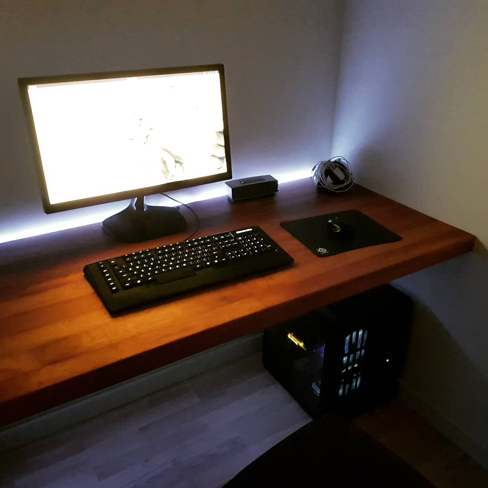
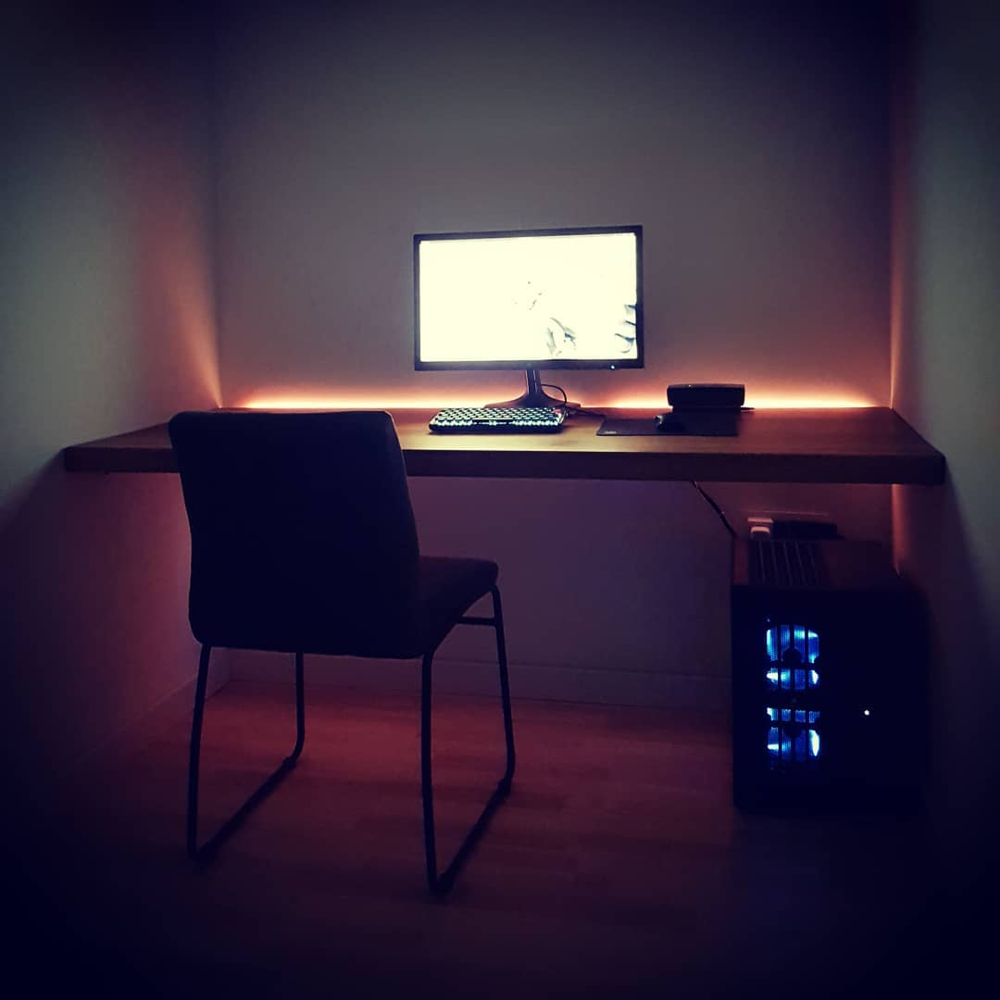

_*The keyboard on the cover image is not Apex Raw, but a newer model._

**Using the [lofree Dot](https://www.lofree.co/collections/keyboards/products/dot-mechanical-keyboard) wireless mechanical keyboard for 3 days has been painful at best. And because of that I've decided to resurrect my old keyboard which has served me well in the past.**

To be honest, in the past I've used the dot keyboard for one year as my main keyboard for sure. During that time I may have become accustomed to it... because none of the things that bother me now bothered me then.

## Lofree Dot keyboard

As you can see from the image above, the Lofree Dot keyboard (in future reference just DOT) is a small black wireless mechanical keyboard. It can pair up to three devices using bluetooth and has a toggle for when working on a Mac or a PC. The switches are Gateron mechanical switches and the keys are rounded. The LED brightness has 3 levels to use.

### Things that annoy me about it

- **The layout (position of keys) of the keyboard is a little bit off.** If you are used to typing with ten fingers you will find this to be very annoying because some keys are not where you expect them, but a little bit off. I was told that in the DOT2 version of this keyboard that has been fixed.
- **The keys feel woobly.** Maybe this is because the keys are round. _Will get back to this later in the post._
- **Too bright once turned on.** When you turn it on, it is set to maximum brightness which is like a lighthouse in the dark night. Whenever I turn it on, I have to set the brightness to the lowest setting.
- **Keys would get stuck at random times.** I would be typing something and then in the middle of that my text would just become `zzzzzzzzzzzzzzzzzzzzzzzzzzzzzzzzzzzzzz` for some reason.
- **Bottom left modifier keys are in wrong order.** This is maybe the biggest deal breaker for me. On almost all regular keyboard the order is this: <kbd>Ctrl fn(optional) Windows Alt</kbd>, but on this keyboard it is: <kbd>fn(optional) Ctrl Alt Windows</kbd>. This is most annoying because my muscle memory when coding is used to having the most bottom left button to be <kbd>Ctrl</kbd>, and that a combination of <kbd>Ctrl+Alt</kbd> has a <kbd>Windows(Super)</kbd> key in between. Things like this are what annoys me the most.

> Because of the downfalls of the DOT keyboard I started looking for a new keyboard.

## [Redragon Kumara K552 RGB](https://www.redragonzone.com/products/redragon-k552-kumara-87-key-led-rgb-backlit-mechanical-computer-illuminated-keyboard-with-blue-switches-for-pc-gaming-compact-abs-metal-design)

When the DOT was not being able to work correctly on using over Bluetooth (later I discovered that it was because of dust...) I bought myself a cheap replacement wired keyboard.

The Reddragon Kumara K552 (in future reference just K552) is a mechanical keyboard with blue switches look-a-likes, RGB colors, different lightning modes, lightning speeds, backlight brightness and all that could be set using key combinations on the keyboard itself without any software being installed on the OS.

I use this keyboard in my work office. It is loud AF. It is clicky AF. I could see myself buying another one just because they are so cheap and actually very good. It looks very nice also. There are a couple things that look cheap to me, which they could fix and it would be a superb keyboard (With a much higher price :)).

To me there are only two things that annoy me about it:

1. **Metallic sound on some key presses.** It kind of resonates in your ear. Over time you don't notice it, but it is there. This is probably the reason why it is so cheap.
2. **Ugly Reddragon logo above the navigation keys**. This is a visual annoyance to me, but because of this the whole keyboard looks cheap.

I was just about to buy a white version of this keyboard for my home office, when I remembered that I have in my possesion my old keyboard the Apex Raw.

## Steelseries Apex Raw keyboard

When I bought the DOT keyboard I gave my brother the Apex Raw. He used it until very recently when he bought himself a new Logitech mechanical keyboard and returned this one to me. I've decided to dust it off and give it a go.

**Even tough this is not a mechanical keyboard, I did a lot of programming with it and never had any complaints.**

The Apex Raw was released in 2013. It has 17 programmable macro keys, white backlight and it is a full size keyboard with an integrated palm rest.

My father bought me this keyboard when we were in Zagreb once.

The interesting things about it is that the key layout is US, but they have added stickers (or is it a lite engraving, because I can't take them off) for the Croatian layout. I prefer the US layout for coding because a lot of characters requires less typing than in the Croatian layout. Also, only the US key characters are illuminated, so in the dark only they light up. I have replaced the <kbd>Z</kbd> key with the <kbd>Y</kbd> key and voila I have the standard US layout.

I cleaned it, removed stickers from when it was at my brother and it looked almost as new. It was missing bottom rubber pads that prevent it from sliding. I really wanted to use it and I improvised by using some material that I found on an unused surge protector. It is like some type of hard foam. I glued it on and it worked like a charm. Now it does not slide and has no flex because I glued it on at four different positions instead of two where it had rubbers pads before.

Now was the moment of truth. I had to connect it to the PC and test each key if it works. All the keys worked in Linux except the macro keys. I could not even map them to anything because there were not being registered.

## Apexctl

I discovered this package on GitHub [AstroSnail/apexctl](https://github.com/AstroSnail/apexctl) where it said that it would enable me to use the macro keys on Linux.

After some looking around I noticed that the repository has been started just recently at the end of 2019 and that the guy is working on it daily. This is a good sign because the [ApexCtl from tuxmark5](https://github.com/tuxmark5/ApexCtl) hasn't been updated since 2016 and has not worked for me when I tried it. I tried installing the driver, but I had some [issues](https://github.com/AstroSnail/apexctl/issues/4). After opening an issue, the author contacted me and we managed to get it working 100% correctly.

I can't tell you how happy I am to be able to use this keyboard again. If it dies I will probably try to buy it again.